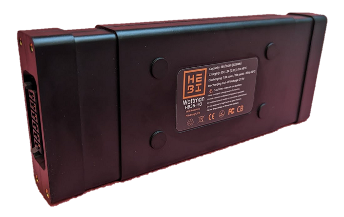

# A-2463-01 - Wattman Battery Pack
The HEBI “Wattman” Battery is our modular, airline-ready Lithium Ion battery pack designed for robotics applications. This 36V 93.6Wh pack is under the 100Wh limit for lithium ion batteries in carry on luggage and comes UN-38.3 and CB-IEC62133 certified.

Each battery pack is equipped with a blade-type power connector, M3 mounting holes, and embossed features for maximum implementation flexibility. Built-in enable circuitry keeps the connector de-energized for storage.

Integrated LEDs provide a quick charge estimate on demand. An integrated BQ34Z100-G1 "Fuel Gauge" IC provides more accurate state-of-charge information and is accessible through I2C.

| | |
|-|-|
| Pack Arrangement | 10S1P ITR18650-2600P Lithium Ion Cells
| Capacity | 93.6Wh (36V, 2.6Ah)
| Charge Profile | 1.3A (0.5C), 0 to 45°C   42V Cutoff
| Discharge Profile | 7.8A Cont. / 13A Peak, -20 to 60°C   27.5V Cutoff
| Connector | Battery: SAMTEC MPS-06-7.70-03-L-V   Mating: SAMTEC MPT-06-6.30-01-T-V
| Dimensions | Battery: 206mm x 80mm x 25mm   Battery w/ Cap: 221mm x 80mm x 25mm
| Weight | Battery: 650g   Battery w/ Cap: 700g
| More Info | [HEBI Docs](https://docs.hebi.us/hardware.html#battery)

