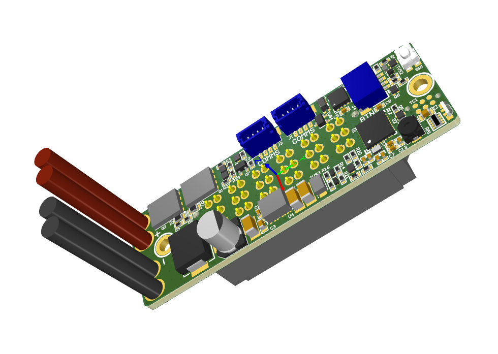

# PCBA-2121-01 - Battery Interface Board
The Battery Interface Board (BIB) is part of an open source project to create a smart battery solution.

The BIB is designed to be as compact as possible - its footprint measures 19x60mm. This allows it to fit inside the footprint of a cap for the [HEBI Wattman Battery](../A-2463-01%20Wattman%20Battery/A-2463-01.md). 

## More Info
More detailed project info is available here:
- [Main Project Repo](https://github.com/HebiRobotics/hebi-firmware-battery-common)
- [CAN Protocol](https://github.com/HebiRobotics/hebi-firmware-battery-protocol)
- [Application Source](https://github.com/HebiRobotics/hebi-firmware-battery)
- [Bootloader Source](https://github.com/HebiRobotics/hebi-firmware-battery-bootloader)

## Changelog
Rev B02:
- Lowered resistance for VREV_SNS voltage divider
- Fixed switch location / button circuit
- Fixed DMN62D0LFD-7 footprint
- Fixed DSG / CHG naming convention
- Fixed Stencil for Variants
- Changed R8 to 200k

Rev B01:
- Changed microcontroller to STM32L432KCU6
- Changed SPKR to PA6 to use TIM16
- Added PULLDOWN on BOOT0 (PH3)
- Added diode to pullup on PB_EXT to prevent back-loading on unpowered boards
- Removed extra OUTPUT_EN indicator LED
- Added onboard button (past input buffer so that it does not trigger other boards)
- Removed extra current sensor
- Removed MAC Address chip
- Added battery reset circuit
- Added crystal oscillator
- Added reverse input voltage detection
- Added charger detection
- Changed wakeup pin to WKUP4
- VBAT_SNS cutoff to save power 
- Changed VBAT_SNS to use OPAMP1, reduced current draw
- Added more capacitance to VBAT to support battery reset
- Added separate CHG / DSG control

Rev B00:
- First Commit

